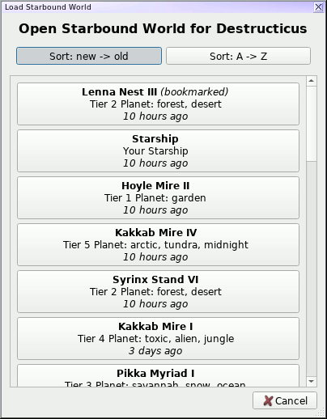
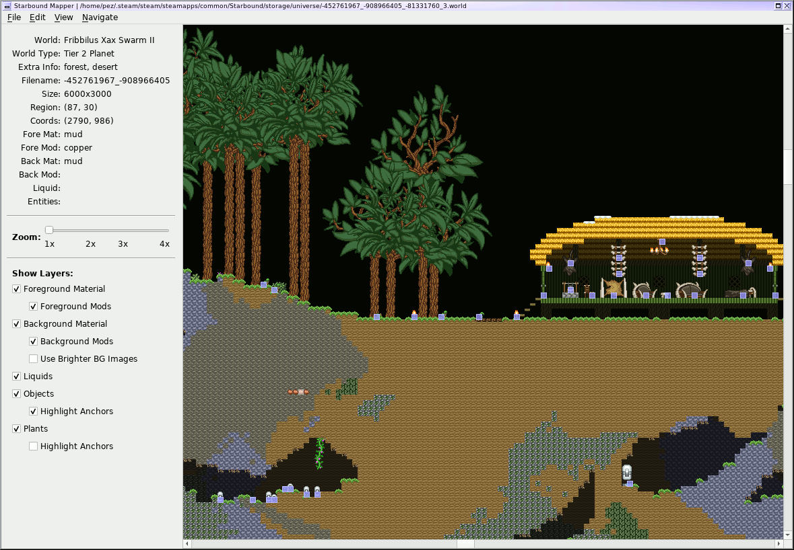
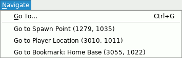

Python Starbound Mapper
-----------------------

Yet another Starbound mapper!  This is in pretty early stages, but is at
least pretty functional as a bare-bones map viewer.

Uses:
 - Python 3
 - python-pillow
 - PyQt5
 - appdirs
 - timeago
 - [py-starbound](https://github.com/blixt/py-starbound) (by blixt)

Installation
------------

This section's forthcoming -- I'll eventually have this packaged up
properly so that it can be installed via `pip`, and ideally have some
prebundled Windows EXEs, etc.  For now, just make sure you've got a
Python 3 environment with the above libraries installed, and run it
right from the git checkout.

Usage
-----

The game will attempt to autodetect your Starbound installation directory
(which is *completely* untested on Windows/Mac).  If the install directory
can't be found, the app will prompt you to choose it manually (and this
can be changed later via the `Edit -> Settings` menu).

The default "Open" dialog will let you choose a world to open first by
player name, and then by the world name.  You can get a more standard
file-opening dialog with `Ctrl-Shift-O`, but this dialog should be much
friendlier:

The map will start out centered on the level spawn point, though if the
level contains a mech beacon, it will be centered there instead (since
levels with mech beacons generally don't have anything interesting around the
spawn point).  Once on the main screen, there's not a lot to do except scroll
around using scrollbars or by dragging the map:

The information about the currently-hovered tile will be shown on the lefthand
side of the screen, which can be resized by dragging on the edge.

The "Navigate" menu will let you go directly to a specific coordinate, the
spawn point, the level mech beacon (if one exists), the "current" player
location (if this is the map the player is currently on), or to any bookmarks
set by the user.  Note that you *must* load the world using the by-name
dialog rather than the by-file open dialog, in order to have bookmarks
and/or current location in the Navigate menu -- that information is stored
in the Player object.

TODO
----

 - Add NPCs/Enemies/Monsters/Vehicles?
   - (What's a StagehandEntity, I wonder?)
 - Highlight tiles for info
   - Click for full info
 - Zoom
   - Slider
   - `+`/`-` via keyboard
 - Initial resource load / open dialogs don't center on parent window
 - Minimap
   - I'll have to see how feasible this is - I'd imagined just a simple
     little thing to show which regions have data and which don't, with
     a little box showing the currently-displayed area, but it feels like
     the game populates more regions than you might expect, and I suspect
     it wouldn't actually be that useful
 - Search for item types (ores, quest-related things?)
   - This is something which probably made more sense when the app was
     attempting to load literally the whole map at once.  Might not be
     worth it with the current more-limited loaded set.
 - Platforms seem to draw a black area underneath 'em
 - Visualization of explored areas (as defined by light sources)
 - Autodetect game location improvements
   - Theoretically we autodetect Steam install locations now
   - Completely untested on Windows/Mac
   - Any way to detect GOG installs?
   - Any registry entries or whatever in general for Windows, which aren't
     Steam/GOG specific?
 - Support for mods
 - Performance improvements
   - Resource loading:
     - Could maybe move to loading these on-demand.  The material/matmods
       themselves only take about 0.2sec to fully load (on my system), so
       they're not a problem, but objects take nearly 5sec, and then
       plants add another second or so.
   - Specific tile types
     - Scenes with lots of liquids get bogged down a bit...
   - Map loading/rendering:
     - This is pretty slow, and I'll have to profile it to figure out
       where the slowness actually is.  It's more of an annoyance at
       the moment, though, since we're now only rendering the visible
       areas of the map, rather than loading the entire thing at the
       app startup
     - Render more than just a single extra region on each side?
     - Would like to move map loading into a separate thread so it can
       happen more in the background, rather than freezing the GUI
       while it loads.  (Using the mouse scrollwheel especially is
       quite jerky because of this.)
     - Keep a "history" of loaded Regions and only expire them after
       they haven't been used in N redraws?  That way, scrolling back
       to a previously-visited area would be less likely to have to re-load.
 - Toggles for various element types?
 - Fancier rendering?  (base map materials have "edges" which we completely
   ignore at the moment.  Would presumably increase render times...
   - Material edges
   - Platforms, etc, joining up properly
   - Liquid levels
 - Properly handle on/off items (light sources), open/closed doors, etc
 - Properly handle coloration of objects/tiles?
 - Randomize tiles w/ multiple options (dirt, etc, seems to be randomly
   assigned from four or five options.  The randomization is fixed-seed
   inside Starbound itself, and I highly doubt I'd be able to get it the
   same, but maps would probably still look nicer with them randomized)
 - Parse render templates properly
 - Make sure we gracefully handle situations where the Starbound install dir
   disappears on us between runs; I suspect right now the app will just crash
   and the only way to get it to run again would be to manually clear out the
   config file.

LICENSE
-------

pystarboundmap is licensed under the
[New/Modified (3-Clause) BSD License](https://opensource.org/licenses/BSD-3-Clause).
A copy is also found in [COPYING.txt](COPYING.txt).
