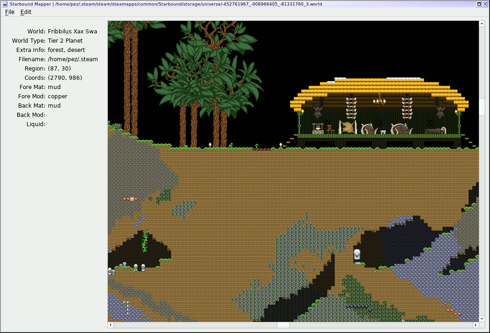

Python Starbound Mapper
-----------------------

Yet another Starbound mapper!  This is in pretty early stages, but is at
least pretty functional as a bare-bones map viewer.

Uses:
 - Python 3
 - python-pillow
 - PyQt5
 - appdirs
 - [py-starbound](https://github.com/blixt/py-starbound) (by blixt)

Screenshot
----------

This is pretty much it, at the moment.  You can open new maps by filename,
or by choosing a character's name followed by a world name.  Click-and-drag
will move the map around, in addition to your usual scrolling methods.
The "Navigate" menu (not yet in the screenshot) will let you go to a
specific coordinate.

The game will attempt to autodetect your Starbound installation directory
(which is *completely* untested on Windows/Mac), but a settings screen
exists for you to manually choose it.

TODO
----

 - Add NPCs/Enemies/Monsters/Vehicles?
   - (What's a StagehandEntity, I wonder?)
 - Highlight tiles for info
   - Click for full info
 - Go to current location (if possible), mech beacons (if possible),
   bookmarks, etc
 - Zoom
   - Slider
   - `+`/`-` via keyboard
 - Initial open dialog doesn't center on parent window?
 - Minimap
   - I'll have to see how feasible this is - I'd imagined just a simple
     little thing to show which regions have data and which don't, with
     a little box showing the currently-displayed area, but it feels like
     the game populates more regions than you might expect, and I suspect
     it wouldn't actually be that useful
 - Search for item types (ores, quest-related things?)
   - This is something which probably made more sense when the app was
     attempting to load literally the whole map at once.  Might not be
     worth it with the current more-limited loaded set.
 - Platforms seem to draw a black area underneath 'em
 - Visualization of explored areas (as defined by light sources)
 - Autodetect game location improvements
   - Theoretically we autodetect Steam install locations now
   - Completely untested on Windows/Mac
   - Any way to detect GOG installs?
   - Any registry entries or whatever in general for Windows, which aren't
     Steam/GOG specific?
 - Support for mods
 - Performance improvements
   - Resource loading:
     - This only takes about 5-6 sec on my machine, so it's not bad,
       but I suspect I could get rid of some spurious PNG conversions
   - Specific tile types
     - Scenes with lots of liquids get bogged down a bit...
   - Map loading/rendering:
     - This is pretty slow, and I'll have to profile it to figure out
       where the slowness actually is.  It's more of an annoyance at
       the moment, though, since we're now only rendering the visible
       areas of the map, rather than loading the entire thing at the
       app startup
     - Render more than just a single extra region on each side?
     - Would like to move map loading into a separate thread so it can
       happen more in the background, rather than freezing the GUI
       while it loads.  (Using the mouse scrollwheel especially is
       quite jerky because of this.)
     - Keep a "history" of loaded Regions and only expire them after
       they haven't been used in N redraws?  That way, scrolling back
       to a previously-visited area would be less likely to have to re-load.
 - Toggles for various element types?
 - Fancier rendering?  (base map materials have "edges" which we completely
   ignore at the moment.  Would presumably increase render times...
   - Material edges
   - Platforms, etc, joining up properly
   - Liquid levels
 - Properly handle on/off items (light sources), open/closed doors, etc
 - Properly handle coloration of objects/tiles?
 - Randomize tiles w/ multiple options (dirt, etc, seems to be randomly
   assigned from four or five options.  The randomization is fixed-seed
   inside Starbound itself, and I highly doubt I'd be able to get it the
   same, but maps would probably still look nicer with them randomized)
 - Parse render templates properly
 - "Attach" objects/plants to Tile objects so they can be reported in
   the mouseover notifications
 - Make sure we gracefully handle situations where the Starbound install dir
   disappears on us between runs; I suspect right now the app will just crash
   and the only way to get it to run again would be to manually clear out the
   config file.
 - Sorting options for by-name opening dialogs.  Right now the players are
   sorted by mtime and the planets by name.  Should be able to toggle both.

LICENSE
-------

pystarboundmap is licensed under the
[New/Modified (3-Clause) BSD License](https://opensource.org/licenses/BSD-3-Clause).
A copy is also found in [COPYING.txt](COPYING.txt).
