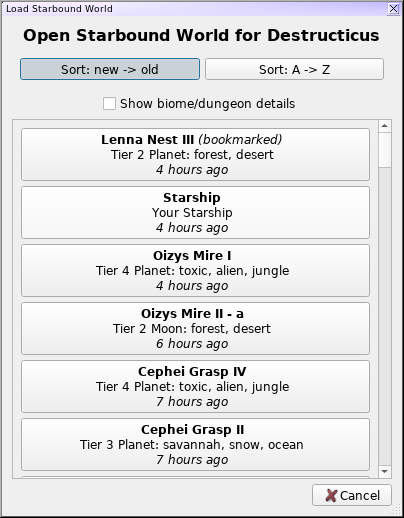
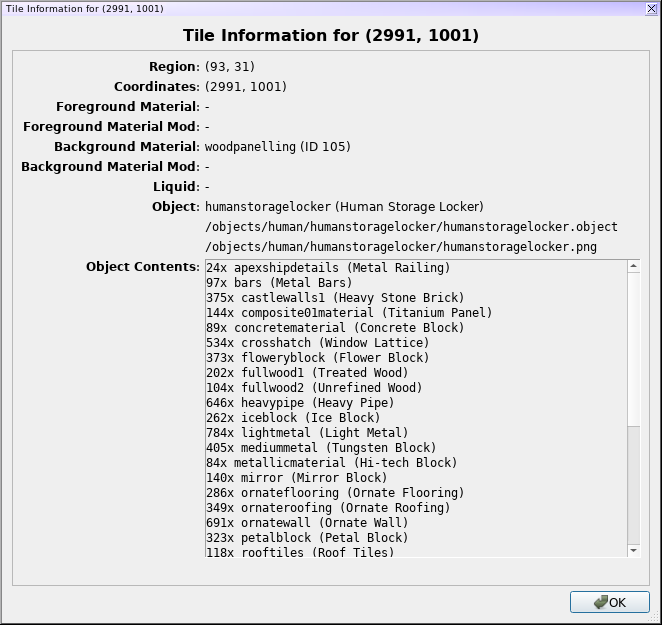

Python Starbound Mapper
-----------------------

Yet another Starbound mapper!

This project is a reasonably basic Starbound map viewer, focusing on a few
simple map introspection tasks, rather than on 100% accurate map rendering.  It
does pretty much everything that I'd been hoping to have in a viewer when
starting out, such as: looking for interesting areas to head while spelunking;
checking my home base for "holes" in the background tiles; clicking on tiles to
get some detailed information such as the images being used, etc.

The app is far from perfect, and in specific could really use some performance
improvements, but my time playing Starbound is more or less at an end, and my
impetus to hack on the map viewer further is pretty much nil.  A quick glance
at the screenshots below will show that the blocks are rendered as simple
squares rather than with all their borders, that platforms don't link up with
each other, and that objects aren't currently rendered in their correct
orientations (or even variations, in most cases).  It doesn't yet attempt to do
correct color tinting or the like, either.  What you see is what you get!

I would, of course, be happy to accept pull requests which address any of the
items on my TODO list, below -- or other features not on the TODO list -- but
I'm no longer actively developing this, myself.

Installation
------------

Pystarboundmap requires Python 3, and is a PyQt5 app.  Python 2 is not supported.

#### Installation to system / user / virtualenv

**NOTE:** This section is not actually true.  PyPI doesn't seem to play nicely
with using git dependency sources, the support for it in the various packaging
components seems to be haphazard and inconsistent at best, and dependent on
the exact versions of things you're using.  So just skip to the "local git
checkout" for now.  Was hoping this would be far more trivial!

~~The easiest way to install/use the mapper is with pip, via:~~

    pip install pystarboundmap

Note that you need a version of setuptools which understands git-based
dependencies, since the `py-starbound` Python library for reading Starbound
data isn't on PyPI.  (Git support in setuptools is almost certainly already
available on your system.)  Then run it from anywhere using the
`pystarboundmap` script:

    $ pystarboundmap
~~

#### Running via local git checkout

If you'd prefer to just run it from the git checkout, you can install its
dependencies with:

    $ pip install -r requirements.txt

(Again, git support is required in setuptools for that to work properly.)
Then launch the GUI with:

    $ python -m pystarboundmap.gui

#### Dependencies

The project makes use of the following:
 - Python 3
 - python-pillow
 - PyQt5
 - appdirs
 - timeago
 - [py-starbound](https://github.com/blixt/py-starbound) (by blixt)

Usage
-----

The game will attempt to autodetect your Starbound installation directory
(which is *completely* untested on Windows/Mac, so please let me know if that
fails completely).  If the install directory can't be found, the app will
prompt you to choose it manually (and this can be changed later via the `Edit
-> Settings` menu).

The default "Open" dialog will let you choose a world to open first by
player name, and then by the world name.  You can get a more standard
file-opening dialog with `Ctrl-Shift-O`, but this dialog should be much
friendlier:

The map will start out centered on the level spawn point, though if the
level contains a mech beacon, it will be centered there instead (since
levels with mech beacons generally don't have anything interesting around the
spawn point).  Once on the main screen, the functionality is pretty basic:

The information about the currently-hovered tile will be shown on the lefthand
side of the screen, which can be resized by dragging on the edge.  You can
scroll using the scrollbars or by click-and-drag on the map itself.  You can
zoom in using the slider, or with the keyboard shortcuts `+` and `-`.

The various layers can be toggled on/off, so if you wanted to check for holes
in the background tiles of your home base, or something, that may be useful.
There are also toggles to draw the background tiles much lighter, so they're
easier to see, and toggles to show the "anchor" points for both objects and
plants.  This is seen in the screenshot, where the object anchor points are in
blue.  Plants will be in green.

To get more detail about a tile, click on it to bring up a dialog with the
extra details:

You can also use `Ctrl-I` or `View -> World Info` to get information about
the world itself:

The "Navigate" menu will let you go directly to a specific coordinate, the
spawn point, the level mech beacon (if one exists), the "current" player
location (if this is the map the player is currently on), or to any bookmarks
set by the user.  Note that you *must* load the world using the by-name
dialog rather than the by-file open dialog, in order to have bookmarks
and/or current location in the Navigate menu -- that information is stored
in the Player object.

TODO
----

 - Add NPCs/Enemies/Monsters/Vehicles?
   - (What's a StagehandEntity, I wonder?)
 - Minimap
   - I'll have to see how feasible this is - I'd imagined just a simple
     little thing to show which regions have data and which don't, with
     a little box showing the currently-displayed area, but it feels like
     the game populates more regions than you might expect, and I suspect
     it wouldn't actually be that useful
 - Search for item types (ores, quest-related things?)
   - This is something which probably made more sense when the app was
     attempting to load literally the whole map at once.  Might not be
     worth it with the current more-limited loaded set.
 - Visualization of explored areas (as defined by light sources)
 - Autodetect game location improvements
   - Theoretically we autodetect Steam install locations now
   - Completely untested on Windows/Mac
   - Any way to detect GOG installs?
   - Any registry entries or whatever in general for Windows, which aren't
     Steam/GOG specific?
 - Support for mods
 - Performance improvements
   - Resource loading:
     - There's probably an unnecessary PNG conversion happening during
       some of the image loading, though these aren't really problematic
       and we're only loading 'em on-demand now anyway.
   - Specific tile types
     - Scenes with lots of liquids get bogged down a bit...
   - Map loading/rendering:
     - This is pretty slow, and I'll have to profile it to figure out
       where the slowness actually is.  It's more of an annoyance at
       the moment, though, since we're now only rendering the visible
       areas of the map, rather than loading the entire thing at the
       app startup
     - Render more than just a single extra region on each side?
     - Would like to move map loading into a separate thread so it can
       happen more in the background, rather than freezing the GUI
       while it loads.  (Using the mouse scrollwheel especially is
       quite jerky because of this.)
     - Keep a "history" of loaded Regions and only expire them after
       they haven't been used in N redraws?  That way, scrolling back
       to a previously-visited area would be less likely to have to re-load.
     - One thing which is slower than I'd like is the expiration of
       Regions.  It's noticeable at 1x zoom, but my experiments with
       going to 0.5x zoom produced some really pronounced pauses.
       Should see if there's a way to speed that up.  (Though the region
       "history" in the point above would at least delay those slowdowns
       for a bit.)
 - Rendering improvements
   - Parsing and using render templates (or at the very least making our
     own internal representation of them) would allow materials to have
     proper "edges", for platforms/pipes/rails to link up properly, etc.
   - Liquid levels
   - on/off items (light sources), open/closed doors, etc
   - coloration of objects/tiles
   - "flip" parameter
   - crop status
     - Unrelated to rendering specifically, but we could probably report
       on crop progress in the tile info dialog.
   - Randomize tiles w/ multiple options (dirt, etc, seems to be randomly
     assigned from four or five options.  The randomization is fixed-seed
     inside Starbound itself, and I highly doubt I'd be able to get it the
     same, but maps would probably still look nicer with them randomized)
   - Layer improvements - right now we're right enough *most* of the time,
     but your own space station is one which doesn't render right at all.
     Should really figure out Starbound's native layer priority and use
     objects' "renderLayer" property.
 - Handle exceptions gracefully
   - An easy crash reproduction is to have a map open, load it in Starbound,
     then try to browse around.  Starbound seems to shuffle the tree around
     enough that we can no longer read it.
   - Make sure we gracefully handle situations where the Starbound install dir
     disappears on us between runs; I suspect right now the app will just crash
     and the only way to get it to run again would be to manually clear out the
     config file.
 - Should we save the layer toggle states (and zoom level) between runs?
   Also the "show biome/dungeon details" checkbox on the load dialog?
 - Read in codex files, to report the real name in container contents.  This
   will require actually lexing the config files in `read_config`, though,
   instead of just doing the poor-man's processing we're doing now.  The codex
   files feature multiline strings (without anything but a dangling quote to
   distinguish them), sometimes feature escaped quotes inside the text, and
   sometimes feature a double-slash, which gets interpreted as a comment.  Not
   worth it for me, at the moment.
 - Would be nice if the zoom kept the map view centered on the mouse
   pointer, when using the keyboard zoom shortcuts
 - Would be nice if the world-info caching progress bar went from 0->100%
   instead of being a more generic "something is happening" bar.
 - Fossil display cabinets render completely wrong

LICENSE
-------

pystarboundmap is licensed under the
[New/Modified (3-Clause) BSD License](https://opensource.org/licenses/BSD-3-Clause).
A copy is also found in [COPYING.txt](COPYING.txt).
